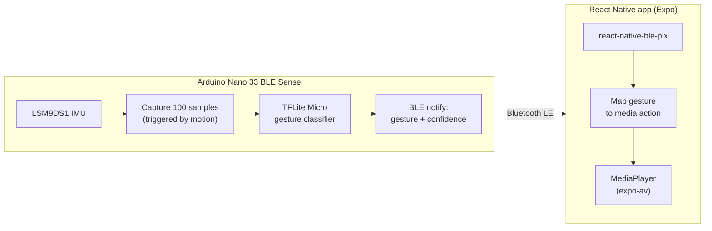

# Gesture Media Controller

A media player app controlled by hand gestures, recognized on-device by a custom TinyML model running on an Arduino Nano 33 BLE Sense and streamed to the phone over Bluetooth LE.


## Demo

<!-- TODO: replace with an actual demo GIF/video showing a swipe gesture controlling the app -->
> 🎥 Demo video/GIF coming soon — will show a hand swipe near the board changing volume/track on the phone in real time.

## What it does

Swipe a hand near the Arduino board and the connected phone reacts, live:

| Gesture | Action |
|---|---|
| Swipe left | Play / pause |
| Swipe right | Next track |
| Swipe up | Volume up |
| Swipe down | Volume down |

The app itself is a small local-file media player (pick audio files from your phone, queue them, scrub, adjust volume) — gestures are just an alternate input method layered on top of it. There's also a live debug readout in the app showing BLE connection status, the last recognised gesture, and the model's confidence score.

## How it works



1. The board continuously reads the onboard IMU (accelerometer + gyroscope) at 100Hz.
2. When rotational movement crosses a threshold (`|gx|`, `|gy|`, or `|gz|` > 60°/s), it captures a 1-second window (100 samples × 6 axes).
3. The window is normalized and quantized to `int8`, then run through a TensorFlow Lite Micro model entirely on-device.
4. The predicted gesture (`up` / `down` / `left` / `right`) and a confidence score are broadcast over two BLE characteristics.
5. The React Native app (via `react-native-ble-plx`) subscribes to both characteristics and maps the incoming gesture string to a media action, with a 350ms debounce so a single swipe doesn't fire twice.

### Model training pipeline

The model was trained from real recorded gesture data:

```
getting_data.ino  →  raw IMU samples over serial (labeled per recording)
        ↓
TINYML.ipynb      →  trains + quantizes a TFLite Micro model
        ↓
model.h           →  exported as a C byte array, flashed into gesture_inference.ino
```

## Project structure

```
app/                       Expo Router mobile app
  (tabs)/index.tsx           Main screen — BLE connection, gesture→action mapping, player UI
  media/MediaPlayer.ts       Playback engine (play/pause/next/volume/seek), wraps expo-av
gesture_inference/
  gesture_inference.ino     Firmware: IMU capture + on-device TFLite Micro inference + BLE broadcast
  model.h                   Exported (generated) TFLite Micro model weights
getting_data.ino           Firmware: records labeled IMU samples over serial for training
TINYML.ipynb                Training notebook: raw samples → quantized TFLite Micro model
```

## Hardware requirements

This project is split into a mobile app and a physical device — to run the full gesture-control loop you need:

- An Arduino Nano 33 BLE Sense (or another board with the LSM9DS1 IMU + BLE)
- Arduino libraries: `Arduino_LSM9DS1`, `ArduinoBLE`, TensorFlow Lite Micro for Arduino

Don't have the board? The app's playback UI (add songs, play/pause, next, volume, scrubbing) still runs without it — it just won't receive gesture input. See the demo above for what the full hardware loop looks like.

## Getting started (app)

```bash
npm install
npx expo start
```

**Important:** this app uses `react-native-ble-plx`, a native BLE module, so it will **not** run in the standard Expo Go sandbox. Use `npx expo run:android` / `npx expo run:ios` (or an Expo Dev Client build) instead.

Other useful scripts:

```bash
npm run lint    # expo lint
npm run web     # expo start --web (playback UI only — no BLE on web)
```

### Windows build notes

Building the native Android project on Windows has a couple of gotchas:

- The Android SDK path must not contain spaces — map it to a drive letter first:
  ```powershell
  subst S: "C:\Users\YourName\AppData\Local\Android\Sdk"
  ```
- Point `JAVA_HOME` at the JBR bundled with Android Studio, and set `GRADLE_USER_HOME` somewhere short to avoid Gradle cache path issues, then build:
  ```powershell
  $env:JAVA_HOME        = 'C:\Program Files\Android\Android Studio\jbr'
  $env:Path             = "$env:JAVA_HOME\bin;S:\platform-tools;$env:Path"
  $env:ANDROID_HOME     = 'S:\'
  $env:ANDROID_SDK_ROOT = 'S:\'
  $env:GRADLE_USER_HOME = 'C:\gradle-home'
  adb reverse tcp:8081 tcp:8081
  npx expo run:android --variant debug
  ```
- On later runs, once the APK is already installed, you only need to restart Metro:
  ```powershell
  adb start-server
  adb reverse tcp:8081 tcp:8081
  npx expo start --dev-client
  ```
  Then open the installed app on your phone — it connects to Metro automatically over USB. For Wi-Fi instead, make sure the phone and laptop are on the same network and scan the QR code shown in the Metro output.

## Getting started (firmware)

1. Open `gesture_inference/gesture_inference.ino` in the Arduino IDE.
2. Install the required libraries listed above via the Library Manager.
3. Flash it to a Nano 33 BLE Sense. It advertises over BLE as `GestureBoard`.
4. Launch the app — it scans for and auto-connects to `GestureBoard`.

## Known limitations

- Gesture set is fixed to four directional swipes (`up`/`down`/`left`/`right`).
- The motion-trigger threshold and debounce window are hardcoded constants, tuned by hand rather than derived from a validation set.
- BLE service/characteristic UUIDs and the device name are duplicated as literals in both the firmware and the app — they must be kept in sync manually if changed.
